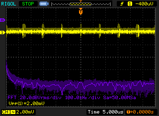

# NegativeRail

An ICL7660 based negative rail daughter board.

# Development

See my eevblog.com [forum thread](https://www.eevblog.com/forum/projects/an-evening-with-the-icl7660/) for lots of oscilloscope screenshots as I tested various iterations of this design.

# Status

This board has been tested using the [dutch oven faraday cage](https://www.eevblog.com/forum/beginners/the-$20-desktop-faraday-cage/):

Performance matches that of the prototype (see the eevblog.com [forum thread](https://www.eevblog.com/forum/projects/an-evening-with-the-icl7660/)).

Noise into a 1k load:

Noise with power supply disconnected (i.e., noise floor of measurement system):

This indicates that the ~750kHz spikes are not coming from the ICL7660 board (perhaps this is due to the switch-mode power supply inside of the scope?).

# Board design v1

Initial board design.

## Gerbers

[gerbers.zip](releases/v1/gerbers.zip)

## Schematic

[PDF](releases/v1/ICL7660-schematic.pdf).

# License

This board design is [Open-Source Hardware](http://www.oshwa.org/definition/).  It is licensed under the [MIT License](http://opensource.org/licenses/MIT).  It was designed by Jason Pepas.

